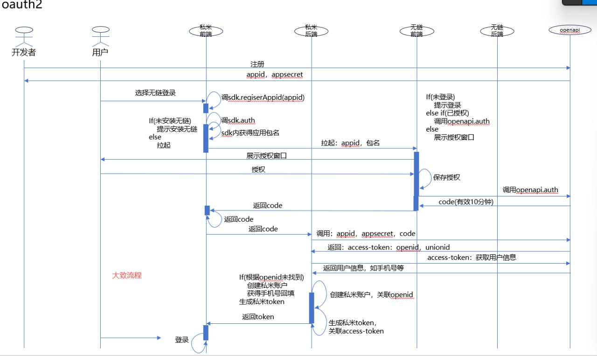

# openapi-chainless


One-tap login plugin for React Native using deep linking between apps.


## 功能简介

`openapi-chainless` 是一个基于 App 间 deep link 唤起的 React Native 一键登录插件，适用于需要在多个 App 之间安全快捷传递登录凭证的场景。

- 支持一键唤起第三方授权 App 并回传 Code
- 支持自定义 Modal 提示未安装授权 App 时的用户引导
- 支持监听其他 App 通过 URL Scheme 拉起本 App 并获取参数
- 兼容 React Native 生态，API 简单易用

## 安装

```sh
npm install openapi-chainless
# 或
yarn add openapi-chainless
# 或
pnpm add openapi-chainless
```

---

## 使用方法

### 1. 主动唤起授权 App 并处理未安装弹窗

```tsx
import React from 'react';
import { Button, View } from 'react-native';
import { useLaunchAuthApp } from 'openapi-chainless';

export default function Demo() {
  const { launch, modal } = useLaunchAuthApp({
    clientId: 'your-client-id',
    onDeepLink: (url, params) => {
      // 监听到被其他App拉起时的链接和参数
      console.log('被拉起的链接:', url);
      console.log('参数:', params);
    }
  });

  return (
    <View style={{ flex: 1 }}>
      <Button title="一键登录" onPress={launch} />
      {modal}
    </View>
  );
}
```

### 2. 监听被其他 App 拉起时的链接

只需在 `useLaunchAuthApp` 传入 `onDeepLink` 回调即可自动监听，无需额外配置。

---

## 自定义弹窗

你可以通过 `CustomModal` 参数自定义未安装授权 App 时的弹窗内容和样式。

#### 1. 实现自定义弹窗组件

```tsx
import React from 'react';
import { Modal, View, Text, TouchableOpacity, StyleSheet } from 'react-native';

const MyCustomModal = ({ visible, onCancel, onConfirm }) => (
  <Modal visible={visible} transparent animationType="fade" onRequestClose={onCancel}>
    <View style={styles.overlay}>
      <View style={styles.container}>
        <Text style={styles.title}>自定义弹窗标题</Text>
        <Text style={styles.desc}>这里是自定义的弹窗内容，你可以放任何提示、图片或说明。</Text>
        <View style={styles.buttonRow}>
          <TouchableOpacity onPress={onCancel} style={styles.cancelBtn}>
            <Text style={styles.cancelText}>取消</Text>
          </TouchableOpacity>
          <TouchableOpacity onPress={onConfirm} style={styles.confirmBtn}>
            <Text style={styles.confirmText}>去安装/跳转</Text>
          </TouchableOpacity>
        </View>
      </View>
    </View>
  </Modal>
);

const styles = StyleSheet.create({
  overlay: { flex: 1, backgroundColor: 'rgba(0,0,0,0.2)', justifyContent: 'center', alignItems: 'center' },
  container: { width: 320, backgroundColor: '#fff', borderRadius: 16, padding: 24, alignItems: 'center' },
  title: { fontSize: 18, fontWeight: 'bold', marginBottom: 8, color: '#222' },
  desc: { fontSize: 15, color: '#222', marginBottom: 16, textAlign: 'center' },
  buttonRow: { flexDirection: 'row', width: '100%', justifyContent: 'space-between', marginTop: 8 },
  cancelBtn: { flex: 1, backgroundColor: '#f2f3f5', borderRadius: 8, marginRight: 8, paddingVertical: 12, alignItems: 'center' },
  confirmBtn: { flex: 1, backgroundColor: '#1890ff', borderRadius: 8, marginLeft: 8, paddingVertical: 12, alignItems: 'center' },
  cancelText: { color: '#666', fontSize: 16 },
  confirmText: { color: '#fff', fontSize: 16, fontWeight: 'bold' },
});
```

#### 2. 传递自定义弹窗给 useLaunchAuthApp

```tsx
import { useLaunchAuthApp } from 'openapi-chainless';
import MyCustomModal from './MyCustomModal';

const { launch, modal } = useLaunchAuthApp({
  clientId: 'your-client-id',
  CustomModal: MyCustomModal,
  onDeepLink: (url, params) => { /* ... */ }
});
```

---

## API 说明

### useLaunchAuthApp(options)

| 参数         | 类型                                               | 说明                         |
| ------------ | -------------------------------------------------- | ---------------------------- |
| clientId     | string                                            | 唤起授权 App 时传递的 clientId|
| onDeepLink   | (url: string, params: Record<string, any>) => void | 监听被其他 App 拉起时的回调   |

返回值：
- `launch`: () =>  { success: boolean; message: string } 主动唤起授权 App
- `modal`: ReactNode 未安装授权 App 时的弹窗组件

#### onDeepLink 回调参数说明
- `url`: 被拉起时的完整链接。
- `params`: 解析后的参数对象，主要字段如下：
  - `code`: 授权结果码。**同意授权时为非空字符串，拒绝时为空字符串**。
  - `phone`: boolean，**为 true 表示授权账号有手机号**。
  - `email`: boolean，**为 true 表示授权账号有邮箱**。

**示例：**
- 用户同意授权且账号有手机号和邮箱：
  ```js
  { code: 'xxxx', phone: true, email: true }
  ```
- 用户同意授权但账号无邮箱：
  ```js
  { code: 'xxxx', phone: true, email: false }
  ```
- 用户拒绝授权：
  ```js
  { code: '', phone: false, email: false }
  ```

---

## 注意事项

- 请确保你的 App 已正确配置 URL Scheme（deep link）能力。
- `clientId` 需与授权 App 约定一致。
- 若需自定义弹窗样式，可修改 `AuthAppModal.tsx`。
- 兼容 React Native 0.60+，如遇类型或编译问题请检查 tsconfig 配置。

---

## License

MIT
